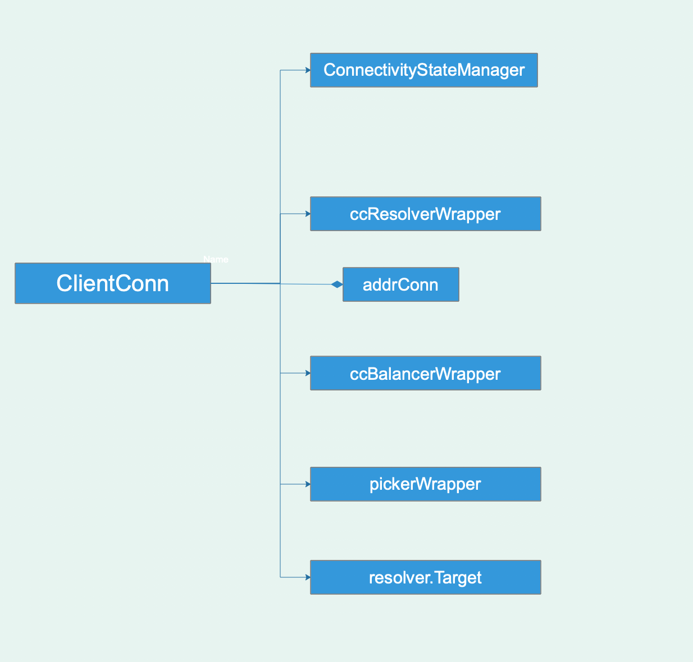

### 从最开始的建立连接开始
```go
func Dial(target string, opts ...DialOption) (*ClientConn, error) {
	return DialContext(context.Background(), target, opts...)
}

func DialContext(ctx context.Context, target string, opts ...DialOption) (conn *ClientConn, err error) {
	cc := &ClientConn{
		target:         target,
		csMgr:          &connectivityStateManager{},
		conns:          make(map[*addrConn]struct{}),
		dopts:          defaultDialOptions(),
		blockingpicker: newPickerWrapper(),
		czData:         new(channelzData),
	}
	/* ... */
}	
```

client初始建立连接，通过DialContext函数，返回了一个ClientConn的结构，先来看一下这个结构定义:



```go
	if cc.dopts.copts.Dialer == nil {
		cc.dopts.copts.Dialer = newProxyDialer(
			func(ctx context.Context, addr string) (net.Conn, error) {
				network, addr := parseDialTarget(addr)
				return dialContext(ctx, network, addr)
			},
		)
	}
````
设置transport的dialer函数，用于底层tcp发起连接。

```go
	if cc.dopts.resolverBuilder == nil {
		// Only try to parse target when resolver builder is not already set.
		cc.parsedTarget = parseTarget(cc.target)
		grpclog.Infof("parsed scheme: %q", cc.parsedTarget.Scheme)
		// 例子里我们的target是"localhost:50051"， scheme是nil
		cc.dopts.resolverBuilder = resolver.Get(cc.parsedTarget.Scheme)
		if cc.dopts.resolverBuilder == nil {
			// If resolver builder is still nil, the parse target's scheme is
			// not registered. Fallback to default resolver and set Endpoint to
			// the original unparsed target.
			grpclog.Infof("scheme %q not registered, fallback to default scheme", cc.parsedTarget.Scheme)
			cc.parsedTarget = resolver.Target{
				Scheme:   resolver.GetDefaultScheme(), // "passthrough"  default scheme
				Endpoint: target,
			}
			cc.dopts.resolverBuilder = resolver.Get(cc.parsedTarget.Scheme) // 这里获取到的builder是passthroughBuilder
		}
	} else {
		cc.parsedTarget = resolver.Target{Endpoint: target}
	}

	// Build the resolver.  重点看一下这个ResolverWrapper
	cc.resolverWrapper, err = newCCResolverWrapper(cc)
	if err != nil {
		return nil, fmt.Errorf("failed to build resolver: %v", err)
	}
	// Start the resolver wrapper goroutine after resolverWrapper is created.
	//
	// If the goroutine is started before resolverWrapper is ready, the
	// following may happen: The goroutine sends updates to cc. cc forwards
	// those to balancer. Balancer creates new addrConn. addrConn fails to
	// connect, and calls resolveNow(). resolveNow() tries to use the non-ready
	// resolverWrapper.
	cc.resolverWrapper.start()
	
```

```go
func newCCResolverWrapper(cc *ClientConn) (*ccResolverWrapper, error) {
	rb := cc.dopts.resolverBuilder // 这里就是上面默认的passthroughBuilder
	if rb == nil {
		return nil, fmt.Errorf("could not get resolver for scheme: %q", cc.parsedTarget.Scheme)
	}

	ccr := &ccResolverWrapper{
		cc:     cc,
		addrCh: make(chan []resolver.Address, 1),
		scCh:   make(chan string, 1),
		done:   make(chan struct{}),
	}

	var err error
	ccr.resolver, err = rb.Build(cc.parsedTarget, ccr, resolver.BuildOption{DisableServiceConfig: cc.dopts.disableServiceConfig})
	if err != nil {
		return nil, err
	}
	return ccr, nil
}

// 看一下passthroughBuilder.Build的实现 
func (*passthroughBuilder) Build(target resolver.Target, cc resolver.ClientConn, opts resolver.BuildOption) (resolver.Resolver, error) {
	r := &passthroughResolver{
		target: target,
		cc:     cc,
	}
	r.start()
	return r, nil
}

// r.cc 其实是ccResolverWrapper， 他继承自resolver.ClientConn
func (r *passthroughResolver) start() {
	r.cc.NewAddress([]resolver.Address{{Addr: r.target.Endpoint}})
}

// NewAddress is called by the resolver implemenetion to send addresses to gRPC.
// 继续跟踪下来，发现NewAddress函数其实是把连接的地址丢给了addrCh channel
func (ccr *ccResolverWrapper) NewAddress(addrs []resolver.Address) {
	select {
	case <-ccr.addrCh:
	default:
	}
	ccr.addrCh <- addrs
}
```

通过上面的分析，发现newCCResolverWrapper函数主要就是把地址丢给ccResolverWrapper的addrCh
channel.接下来继续分析，该channel什么时候被读取？
看一下cc.resolverWrapper.start() 实现

```go
func (ccr *ccResolverWrapper) start() {
	go ccr.watcher()
}

// watcher processes address updates and service config updates sequentially.
// Otherwise, we need to resolve possible races between address and service
// config (e.g. they specify different balancer types).
func (ccr *ccResolverWrapper) watcher() {
	for {
		select {
		case <-ccr.done:
			return
		default:
		}

		select {
		case addrs := <-ccr.addrCh: // addrCh channel在这被读取
			select {
			case <-ccr.done:
				return
			default:
			}
			grpclog.Infof("ccResolverWrapper: sending new addresses to cc: %v", addrs)
			// 这里调用ClientConn的handleResolvedAddrs函数，将addrs传进去.
			ccr.cc.handleResolvedAddrs(addrs, nil)
		case sc := <-ccr.scCh:
			select {
			case <-ccr.done:
				return
			default:
			}
			grpclog.Infof("ccResolverWrapper: got new service config: %v", sc)
			ccr.cc.handleServiceConfig(sc)
		case <-ccr.done:
			return
		}
	}
}

// ccResolverWrapper.watcher()函数拿到地址之后，直接传给了ClientConn，我们继续看handleResolvedAddrs函数
func (cc *ClientConn) handleResolvedAddrs(addrs []resolver.Address, err error) {
        if newBalancerName == "" {
            newBalancerName = PickFirstBalancerName   // 我们的balancer默认为pickfirst
        }
        cc.switchBalancer(newBalancerName)
        cc.balancerWrapper.handleResolvedAddrs(addrs, nil)
}

// switchBalancer 如其名，关闭旧的balancer，切换为新的balancer
func (cc *ClientConn) switchBalancer(name string) {
	if cc.balancerWrapper != nil {
		cc.balancerWrapper.close()
	}

	// 默认的balancewr builder是pickfirst
	builder := balancer.Get(name)
	if builder == nil {
		grpclog.Infof("failed to get balancer builder for: %v, using pick_first instead", name)
		builder = newPickfirstBuilder()  // pickfirstBuilder
	}
	cc.preBalancerName = cc.curBalancerName
	cc.curBalancerName = builder.Name()
	cc.balancerWrapper = newCCBalancerWrapper(cc, builder, cc.balancerBuildOpts)	
}

func newCCBalancerWrapper(cc *ClientConn, b balancer.Builder, bopts balancer.BuildOptions) *ccBalancerWrapper {
	ccb := &ccBalancerWrapper{
		cc:               cc,
		stateChangeQueue: newSCStateUpdateBuffer(),
		resolverUpdateCh: make(chan *resolverUpdate, 1),
		done:             make(chan struct{}),
		subConns:         make(map[*acBalancerWrapper]struct{}),
	}
	go ccb.watcher()
	ccb.balancer = b.Build(ccb, bopts) // pickfirstBalancer
	return ccb
}

func (ccb *ccBalancerWrapper) watcher() {
	for {
		select {
		case t := <-ccb.stateChangeQueue.get(): // 连接状态改变时通知
			ccb.stateChangeQueue.load()
			select {
			case <-ccb.done:
				ccb.balancer.Close()
				return
			default:
			}
			ccb.balancer.HandleSubConnStateChange(t.sc, t.state)
		case t := <-ccb.resolverUpdateCh:   // 重点。 resolverUpdateCh 关注resolverUpdateCh channel
			select {
			case <-ccb.done:
				ccb.balancer.Close()
				return
			default:
			}
			// balancer开始addrs的处理, 这里的balancer就是前面赋值的pickfirstBalancer
			ccb.balancer.HandleResolvedAddrs(t.addrs, t.err)
		case <-ccb.done:
		}

		select {
		case <-ccb.done:
			ccb.balancer.Close()
			ccb.mu.Lock()
			scs := ccb.subConns
			ccb.subConns = nil
			ccb.mu.Unlock()
			for acbw := range scs {
				ccb.cc.removeAddrConn(acbw.getAddrConn(), errConnDrain)
			}
			return
		default:
		}
	}
}

目前看来balancer和resolver的方式一样,都是先watcher，然后在其他地方触发，我们继续看cc.balancerWrapper.handleResolvedAddrs(addrs, nil)定义
func (ccb *ccBalancerWrapper) handleResolvedAddrs(addrs []resolver.Address, err error) {
	select {
	case <-ccb.resolverUpdateCh:
	default:
	}
	ccb.resolverUpdateCh <- &resolverUpdate{
		addrs: addrs,
		err:   err,
	}
}
```

通过上面的分析，可以发现resolver和balancer之间的关系：
ccResolverWrapper将addrs抛出，通过ClientConn将地址传递给balancer，balancer拿到addrs之后开始ccb.balancer.HandleResolvedAddrs(t.addrs,
t.err),继续看代码：

```go
func (b *pickfirstBalancer) HandleResolvedAddrs(addrs []resolver.Address, err error) {
	if err != nil {
		grpclog.Infof("pickfirstBalancer: HandleResolvedAddrs called with error %v", err)
		return
	}
	if b.sc == nil {
		// 这里调用ccBalancerWrapper.NewSubConn ==> acBalancerWrapper
		b.sc, err = b.cc.NewSubConn(addrs, balancer.NewSubConnOptions{})
		if err != nil {
			grpclog.Errorf("pickfirstBalancer: failed to NewSubConn: %v", err)
			return
		}
		b.cc.UpdateBalancerState(connectivity.Idle, &picker{sc: b.sc})
		b.sc.Connect()
	} else {
		b.sc.UpdateAddresses(addrs)
		b.sc.Connect()
	}
}

// 学习一下balancer和conn是怎么联系的。
func (ccb *ccBalancerWrapper) NewSubConn(addrs []resolver.Address, opts balancer.NewSubConnOptions) (balancer.SubConn, error) {
	ac, err := ccb.cc.newAddrConn(addrs) // 最终把addrs传递给了AddrConn。
	acbw := &acBalancerWrapper{ac: ac}
	ccb.subConns[acbw] = struct{}{}
}

// 在这里把ClientConn的blockingpicker更新为picker{sc: b.sc}
func (ccb *ccBalancerWrapper) UpdateBalancerState(s connectivity.State, p balancer.Picker) {
	ccb.cc.blockingpicker.updatePicker(p)  
}

// 终于开始了底层连接
func (acbw *acBalancerWrapper) Connect() {
	acbw.mu.Lock()
	defer acbw.mu.Unlock()
	acbw.ac.connect()
}

func (ac *addrConn) connect() error {
	// Start a goroutine connecting to the server asynchronously.
	go func() {
		if err := ac.resetTransport(); err != nil {
			grpclog.Warningf("Failed to dial %s: %v; please retry.", ac.addrs[0].Addr, err)
			if err != errConnClosing {
				// Keep this ac in cc.conns, to get the reason it's torn down.
				ac.tearDown(err)
			}
			return
		}
		ac.transportMonitor()
	}()	
}
```

把resolver、balancer、ClientConn串起来分析一下，resolver通过监听addrs，通知给balancer，balancer创建picker并赋值给ClientConn的blockingpicker，然后开始传输层的连接和维护.
下面开始transport的分析: 

```go
func (ac *addrConn)resetTransport() ==> func (ac *addrConn) createTransport ==> func newHTTP2Client(connectCtx, ctx, target, opts, onSuccess)
```

可以看到，transport最终是一个http2的client，http2后面分析，到目前为止，一个带有resover和balancer的ClientConn已经创建好，可以用来发送消息了。
接下来我们开始分析数据的发送和接收.