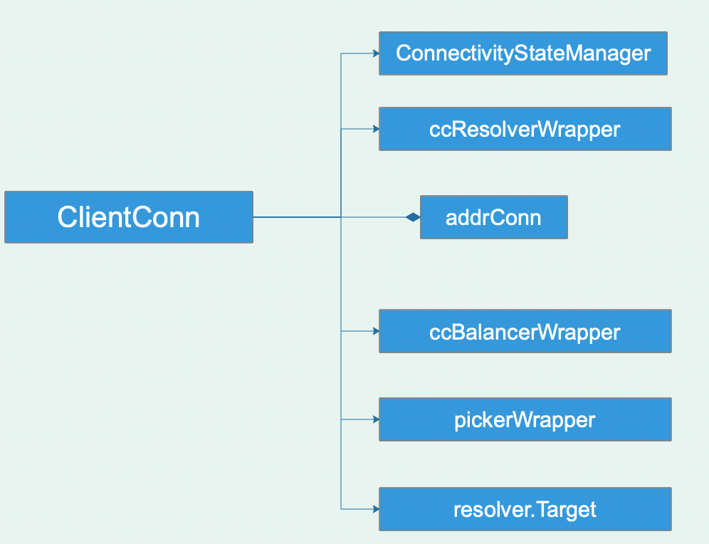

### 从最开始的建立连接开始
```go
func Dial(target string, opts ...DialOption) (*ClientConn, error) {
	return DialContext(context.Background(), target, opts...)
}

func DialContext(ctx context.Context, target string, opts ...DialOption) (conn *ClientConn, err error) {
	cc := &ClientConn{
		target:         target,
		csMgr:          &connectivityStateManager{},
		conns:          make(map[*addrConn]struct{}),
		dopts:          defaultDialOptions(),
		blockingpicker: newPickerWrapper(),
		czData:         new(channelzData),
	}
	/* ... */
}	
```

client初始建立连接，通过DialContext函数，返回了一个ClientConn的结构，先来看一下这个结构定义:



