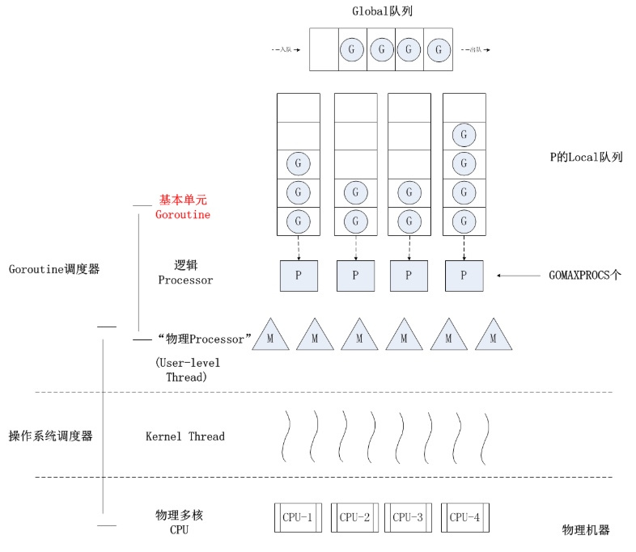

# GMP简介
 
G，P，M是golang进程调度的核心，可以说只要在runtime中运行，就离不开GPM。先看一下各个结构，然后分析一下他们之间的关系。

## 核心概念
### G(goroutine)
---

G是goroutine的首字母，它是用户级的线程，也称作协程，可以使用go 关键字创建。
goroutine的创建，运行，休眠，恢复都被runtime管理着，当协程被创建时，由runtime在合适的时机调用。

### P(process)
---

P是process的首字母，当协程G被创建时，只有跟P绑定才能运行。所以P可以用来控制系统真正的并发数。

### M(machine)
---

M是machine的首字母，在当前的go版本中等于系统线程，M运行G是需要P参与的，可以认为一个M就是一个多路复用，
他循环从任务列表(P)中获取task(G)来运行。

### G-P-M调度模型

如上图所示，每个P有一个local队列，local队列中就放着等待运行的G，M则不断的从拥有的P中获取G来运行。