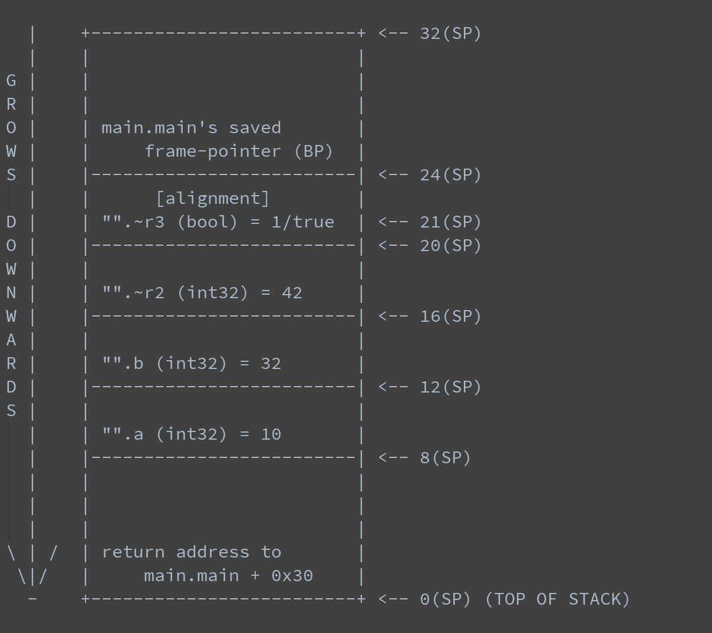

# plan9汇编笔记

# 从一段函数调用代码说起，创建一个main.go文件
```
package main

//go:noinline
func add(a, b int32) (int32, bool) { return a + b, true }

func main() { add(10, 32) }

```

使用命令 go tool compile -S main.go 生成汇编文件。

```
"".add STEXT nosplit size=20 args=0x10 locals=0x0
        0x0000 00000 (main.go:10)       TEXT    "".add(SB), NOSPLIT, $0-16
        0x0000 00000 (main.go:10)       FUNCDATA        $0, gclocals·33cdeccccebe80329f1fdbee7f5874cb(SB)
        0x0000 00000 (main.go:10)       FUNCDATA        $1, gclocals·33cdeccccebe80329f1fdbee7f5874cb(SB)
        0x0000 00000 (main.go:10)       FUNCDATA        $3, gclocals·33cdeccccebe80329f1fdbee7f5874cb(SB)
        0x0000 00000 (main.go:10)       PCDATA  $2, $0
        0x0000 00000 (main.go:10)       PCDATA  $0, $0
        0x0000 00000 (main.go:10)       MOVL    "".b+12(SP), AX
        0x0004 00004 (main.go:10)       MOVL    "".a+8(SP), CX
        0x0008 00008 (main.go:10)       ADDL    CX, AX
        0x000a 00010 (main.go:10)       MOVL    AX, "".~r2+16(SP)
        0x000e 00014 (main.go:10)       MOVB    $1, "".~r3+20(SP)
        0x0013 00019 (main.go:10)       RET
        0x0000 8b 44 24 0c 8b 4c 24 08 01 c8 89 44 24 10 c6 44  .D$..L$....D$..D
        0x0010 24 14 01 c3                                      $...

```
接下来一行一行的来分析 

```
 0x0000 00000 (main.go:10)       TEXT    "".add(SB), NOSPLIT, $0-16
```
+ 0x0000 : 当前指令相对于当前函数的偏移量 

+ TEXT "".add ：TEXT 指令声明了 "".add 是 .text 段(程序代码在运行期会放在内存的
.text 段中)的一部分，并表明跟在这个声明后的是函数的函数体。在链接期，"" 这个空字符会被替换为当前的包名: 也就是说，"".add 在链接到二进制文件后会变成 main.add。

+ (SB): SB 是一个虚拟寄存器，保存了静态基地址(static-base)
指针，即我们程序地址空间的开始地址。

+ NOSPLIT: 向编译器表明不应该插入 stack-split 的用来检查栈需要扩张的前导指令

+ $0-16: $0 代表即将分配的栈帧大小；而 $16 指定了调用方传入的参数和返回值的大小。

```
0x0000 00000 (main.go:10)       MOVL    "".b+12(SP), AX
0x0004 00004 (main.go:10)       MOVL    "".a+8(SP), CX
```
+ (SP): SP stack pointer,表示栈顶
 
+ Go的调用规约要求每一个参数都通过栈来传递，这部分空间由 caller 在其栈帧(stack
frame)上提供。调用其它过程之前，caller
就需要按照参数和返回变量的大小来对应地增长(返回后收缩)栈。

+ Go 编译器不会生成任何 PUSH/POP 族的指令: 栈的增长和收缩是通过在栈指针寄存器 SP 上分别执行减法和加法指令来实现的。

+ "".b+12(SP) 和 "".a+8(SP) 分别指向栈的低 12 字节和低 8 字节位置(记住:
栈是向低位地址方向增长的！)。
从汇编层面看到a离栈顶更近，说明参数是从右向左入栈的。那么为什么a的地址是8(sp)而不是0(sp)呢？
因为调用方通过使用CALL伪指令，把其返回地址保存在了0(sp)处。

```
0x0008 00008 (main.go:10)       ADDL    CX, AX
```
ADDL 进行实际的加法操作，L 这里代表 Long，4 字节的值，其将保存在 AX 和 CX 寄存器中的值进行相加，然后再保存进 AX 寄存器中。

```
0x000a 00010 (main.go:10)       MOVL    AX, "".~r2+16(SP)
0x000e 00014 (main.go:10)       MOVB    $1, "".~r3+20(SP)
```        

+ 将add操作的结果从寄存器AX取出，移动到"".~r2+16(SP)位置，"".~r2并没有语义。 常量bool的返回是通过$1,
"".~r3+20(SP)移动到栈所对应位置，因为内存对齐的缘故，所以bool值也占用4个字节。

```
0x0013 00019 (main.go:10)       RET
```
+ 最后的 RET 伪指令告诉 Go 汇编器插入一些指令，这些指令是对应的目标平台中的调用规约所要求的，从子过程中返回时所需要的指令。
一般情况下这样的指令会使在 0(SP) 寄存器中保存的函数返回地址被 pop 出栈，并跳回到该地址。



上面是main.add 即将执行 RET 指令时的栈的情况.

# 现在我们来解剖一下main函数

```
0x0000 TEXT		"".main(SB), $24-0
  ;; ...omitted stack-split prologue...
  0x000f SUBQ		$24, SP
  0x0013 MOVQ		BP, 16(SP)
  0x0018 LEAQ		16(SP), BP
  ;; ...omitted FUNCDATA stuff...
  0x001d MOVQ		$137438953482, AX
  0x0027 MOVQ		AX, (SP)
  ;; ...omitted PCDATA stuff...
  0x002b CALL		"".add(SB)
  0x0030 MOVQ		16(SP), BP
  0x0035 ADDQ		$24, SP
  0x0039 RET
  ;; ...omitted stack-split epilogue...
```
```
0x0000 TEXT		"".main(SB), $24-0
```
+ 全局符号函数，被链接之后名字会变成 main.main。它分配了 24 字节的栈帧，且不接收参数，不返回值。

```
0x000f SUBQ		$24, SP
0x0013 MOVQ		BP, 16(SP)
0x0018 LEAQ		16(SP), BP
```

+ main作为调用者，对虚拟栈指针寄存器SP（stack
  pointer)做减法，将真正的栈帧增加24个字节(因为栈是由高向低增长的，所以SUBQ指令将栈帧调整的更大了)
+ 这24个字节中:
  + 8 个字节(16(SP)-24(SP)) 用来存储当前帧指针 BP (这是一个实际存在的寄存器)的值，以支持栈的展开和方便调试
  + 1+3 个字节(12(SP)-16(SP)) 是预留出的给第二个返回值 (bool) 的空间，除了类型本身的 1 个字节，在 amd64 平台上还额外需要 3 个字节来做对齐
  + 4 个字节(8(SP)-12(SP)) 预留给第一个返回值 (int32)
  + 4 个字节(4(SP)-8(SP)) 是预留给传给被调用函数的参数 b (int32)
  + 4 个字节(0(SP)-4(SP)) 预留给传入参数 a (int32)
  
+ 最后，跟着栈的增长，LEAQ 指令计算出帧指针的新地址，并将其存储到 BP 寄存器中。

```
0x001d MOVQ		$137438953482, AX
0x0027 MOVQ		AX, (SP)
```

调用方将被调用方需要的参数作为一个 Quad word(8 字节值)推到了刚刚增长的栈的栈顶。尽管指令里出现的 137438953482 这个值看起来像是随机的垃圾值，实际上这个值对应的就是 10 和 32 这两个 4 字节值，它们两被连接成了一个 8 字节值。

```
0x002b CALL		"".add(SB)
```
我们使用相对于 static-base 指针的偏移量，来对 add 函数进行 CALL 调用: 这种调用实际上相当于直接跳到一个指定的地址。

注意 CALL 指令还会将函数的返回地址(8 字节值)也推到栈顶；所以每次我们在 add 函数中引用 SP 寄存器的时候还需要额外偏移 8 个字节！
例如，"".a 现在不是 0(SP) 了，而是在 8(SP) 位置。

```
0x0030 MOVQ		16(SP), BP
0x0035 ADDQ		$24, SP
0x0039 RET
```
最后，我们:

+ 将帧指针(frame-pointer)下降一个栈帧(stack-frame)的大小(就是“向下”一级)
+ 将栈收缩 24 个字节，回收之前分配的栈空间
+ 请求 Go 汇编器插入子过程返回相关的指令